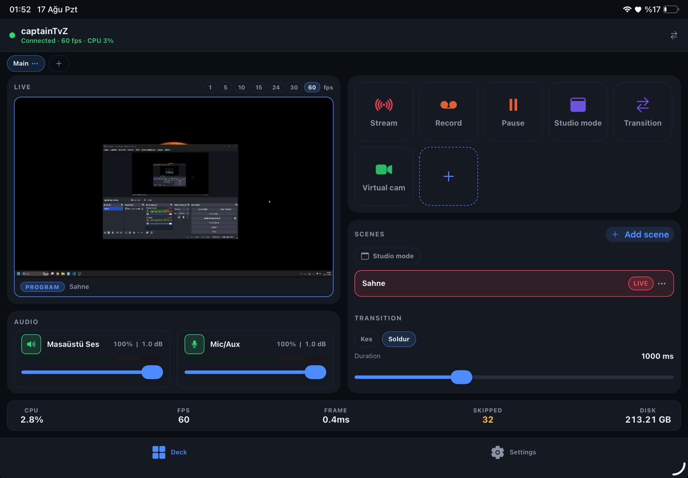
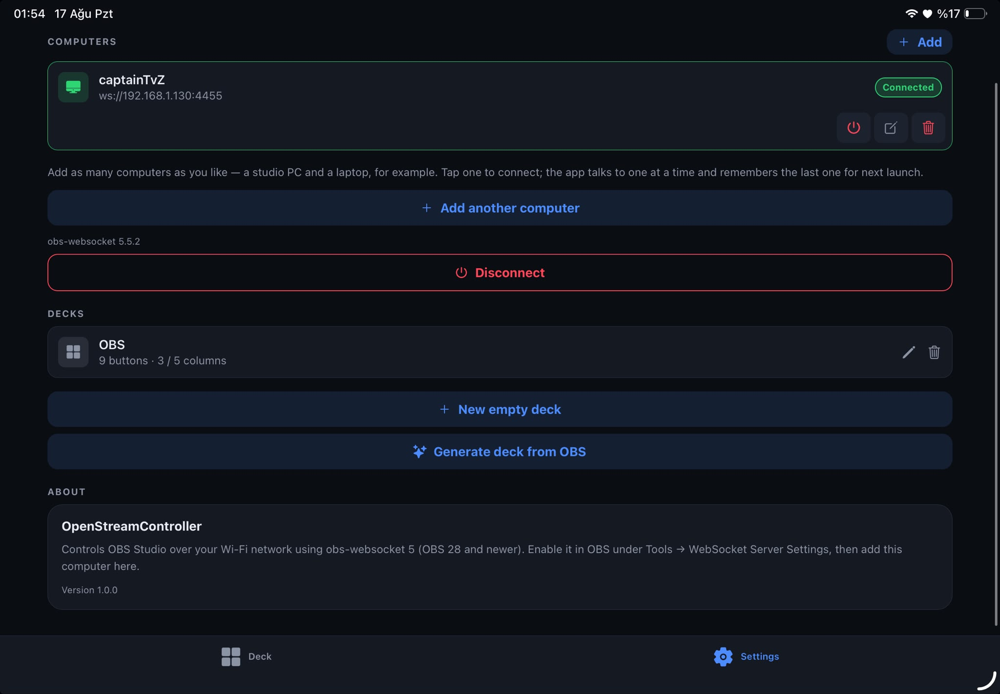

# OpenStreamController

**A Stream Deck for your phone — for OBS Studio.**

Turn any iPhone, iPad or Android device into a wireless control surface for OBS. Switch scenes, start
and stop the stream, mute the mic, watch a live preview of your program output and ride the audio
faders — all over your own Wi-Fi, with nothing extra installed on the streaming PC and no cloud
service in the middle.

[](https://docs.expo.dev/)
[](https://reactnative.dev/)
[](https://obsproject.com/)
[](#requirements)
[](LICENSE)

---

## Screenshots



<p align="center"><em>The deck on a tablet in landscape — live preview and audio faders on the left, buttons,
scenes and transition controls on the right, OBS health along the bottom.</em></p>



<p align="center"><em>Settings — saved computers with connect / edit / remove, and deck management
including “Generate deck from OBS”.</em></p>

---

## Contents

- [Why](#why)
- [Features](#features)
- [Requirements](#requirements)
- [Setting up OBS](#setting-up-obs)
- [Running the app](#running-the-app)
- [Connecting to OBS](#connecting-to-obs)
- [Standalone builds](#standalone-builds)
- [Phones, tablets, rotation](#phones-tablets-rotation)
- [How it is put together](#how-it-is-put-together)
- [Adding a new button action](#adding-a-new-button-action)
- [Troubleshooting](#troubleshooting)
- [Security notes](#security-notes)
- [Contributing](#contributing)
- [License](#license)

## Why

A hardware Stream Deck is a lovely thing and a costly one, and the phone already in your pocket has a
bigger, higher-resolution, multi-touch screen. OpenStreamController speaks OBS's own
[obs-websocket 5](https://github.com/obsproject/obs-websocket) protocol directly, so it needs no
companion app, no helper service and no account — just OBS 28 or newer and a shared Wi-Fi network.

Built with Expo (React Native): one codebase, iOS and Android.

> **Pinned to Expo SDK 54** so it runs in **Expo Go** on iPhone and iPad without an Apple Developer
> account. Expo Go for iOS only ever supports one SDK version; moving past it would mean building a
> custom development client, which needs a paid Apple membership for iOS devices. Android has no such
> restriction.

## Features

### The deck

There are only two tabs — **Deck** and **Settings** — because everything you touch mid-stream belongs
on one screen.

- **Live program preview** beside the grid (preview *and* program side by side in studio mode), so you
  can see what is going out while you cut. The capture rate is switchable from 1 to 60 fps right above
  the picture.
- **A configurable button grid** that lights up with live state: the current scene, whether you are
  streaming, whether a mic is muted. Buttons with something to report show it under the label — the
  stream and recording timecodes tick on the button itself, mute buttons show their fader level.
- **Audio mixer** with a fader and mute button per source, plus **live volume meters**: the same
  green/yellow/red bar OBS draws, fed by OBS's own metering at ~20 fps with a peak-hold tick, so you
  can see the mic is actually picking you up without looking at the PC.
- **Scene list and transition controls** on the same screen, so cutting to a scene never costs a tab
  change.
- **OBS health row** along the bottom: CPU, FPS, frame render time, skipped and dropped frames, free
  disk space.
- **Multiple decks** you can switch between, each with its own buttons and grid size — and
  **Generate deck from OBS** builds a complete one for you from the scenes and audio sources OBS is
  already running, so a new machine is usable in a single tap.

### Scenes and sources

- Full scene list with **studio mode**, preview/program and per-scene source visibility toggles.
- **Create, rename and delete scenes** from the phone.
- Set the active **transition and its duration**, plus a **per-scene transition override** (long-press
  a scene) that OBS uses whenever it cuts to that scene.
- **Add a source** to a scene — create a new one of any kind OBS offers, or drop in a source that
  already exists elsewhere.
- **Source sheet** (long-press a source): live thumbnail, show/hide, lock, restack, per-kind settings
  (text content, browser URL, image or media path, colour), filter on/off switches, and a raw JSON
  editor for everything else.
- Removing is split into **remove from this scene** and **delete everywhere**, because one source can
  live in several scenes at once.

### Button actions

| Group         | Actions                                                                                                   |
| ------------- | --------------------------------------------------------------------------------------------------------- |
| **Scenes**    | Switch scene · Set preview scene · Transition (studio) · Toggle studio mode · Set transition · Set transition duration |
| **Broadcast** | Start/stop stream · Start/stop recording · Pause/resume recording · Toggle virtual camera · Toggle replay buffer · Save replay |
| **Audio**     | Mute / unmute source                                                                                      |
| **Sources**   | Show / hide source · Refresh browser source                                                               |
| **Advanced**  | Switch profile · Switch scene collection · **Custom OBS request**                                         |

Anything not in the list is still reachable: **Custom OBS request** sends any request type in the
obs-websocket protocol with your own JSON payload.

### Several computers

Save as many computers as you like — a studio PC, a laptop, a second streaming box. Each row has
visible **connect / edit / remove** buttons, and removing one deletes its keychain password too. The
status strip at the top of every tab doubles as a switcher: tap it to jump between machines without
leaving the deck. The app talks to one computer at a time and reconnects to the last one it used on
the next launch.

Other niceties: automatic reconnect with backoff when Wi-Fi drops or OBS restarts, haptic feedback on
every press, and the screen stays awake while connected.

## Requirements

| | |
| --- | --- |
| **OBS Studio** | 28 or newer (obs-websocket 5 is built in; older OBS needs the [plugin](https://github.com/obsproject/obs-websocket/releases)) |
| **Phone / tablet** | iOS 15.1+ or Android 7+, on the **same Wi-Fi network** as the computer |
| **To run from source** | [Node.js](https://nodejs.org/) 20 or newer and npm |
| **To run on iOS without a build** | [Expo Go](https://expo.dev/go) for SDK 54 |

## Setting up OBS

1. In OBS: **Tools → WebSocket Server Settings**.
2. Tick **Enable WebSocket server**.
3. Note the **Server Port** (default `4455`).
4. Keep **Enable Authentication** on and copy the password — **Show Connect Info** reveals it.
5. Make sure the computer's firewall allows inbound connections on that port.

Windows firewall, one time, from an elevated PowerShell:

```powershell
New-NetFirewallRule -DisplayName "obs-websocket" -Direction Inbound -Protocol TCP -LocalPort 4455 -Action Allow
```

> If the network is yours alone you can switch **Enable Authentication** off and skip passwords
> entirely — the app connects happily with the password field left empty.

## Running the app

```bash
git clone https://github.com/captainTvZx/OpenStreamController.git
cd OpenStreamController
npm install
npx expo start
```

Then scan the QR code in the terminal with **Expo Go** (Android) or the **Camera** app (iOS). Expo Go
must be the build that supports SDK 54 — it reports its supported SDK on its home screen.

Inside the app: **Settings → Computers → Add**.

## Connecting to OBS

Three ways, easiest first:

1. **Scan the OBS QR code.** In OBS: **Tools → WebSocket Server Settings → Show Connect Info**. Tap
   **Scan QR code** in the app and point the camera at it. Address, port *and* password arrive
   together — nothing to type. (OBS encodes them as `obsws://<ip>:<port>/<password>`.)
2. **Scan the Wi-Fi network.** Finds every computer answering the obs-websocket handshake on your
   subnet and fills in the address. It cannot recover the password — the handshake only reveals
   *whether* one is required — so pair it with the QR code or type the password once.
3. **Type it in.** IP address, port and password by hand. The password field has a reveal toggle and a
   paste button; pasting a whole `obsws://…` string fills every field at once.

> On iOS the first network scan triggers the local-network permission prompt — allow it.

## Standalone builds

```bash
npx eas build --platform android --profile preview
```

That produces an installable APK with no Apple or Google account involved. Android release builds need
cleartext `ws://` traffic on the LAN, which `expo-build-properties` already enables in
[app.json](app.json).

An iOS build installed on a real device requires a paid Apple Developer membership; until then, Expo
Go is the way to run this on iPhone and iPad.

## Phones, tablets, rotation

The deck is built for a tablet lying in landscape next to the keyboard, and adapts from there:

- **Everything fits on one screen.** With button size on *Fit screen* (the default), the tile size is
  solved against the height actually left over after the preview, mixer and health row, so a full deck
  lands on a single screen with no scrolling — on an iPad, a phone, or anything between. Fixed
  **S / M / L** sizes are there when you would rather pin the buttons and scroll.
- **Two layouts, picked in edit mode.** *Scene left* (the default on wide screens) puts the preview and
  faders in a left column and gives the right side to the buttons and the scene list. *Stacked* runs
  preview → buttons → audio down the screen, which is what narrow screens always use. Either way the
  **health bar spans the full width along the bottom**.
- **Portrait and landscape keep separate column counts per deck**, so rotating a tablet never scrambles
  a layout you tuned.
- **Drag to reorder.** In edit mode, drag a button to move it; the rest reflow around it and the new
  order is saved.
- Scene lists, the mixer and the output tiles reflow into two or three columns on wide screens, and
  layouts respect the safe area on all four sides.

**Deck management lives on the deck screen** — long-press a deck tab (or tap the ⋯ on the active one)
to rename, duplicate or delete it. The `+` tab creates a deck. Nothing about decks requires a trip to
Settings.

## How it is put together

```
app/                     expo-router screens
  (tabs)/index.tsx       the deck: preview, button grid, scenes panel, mixer, health row
  (tabs)/settings.tsx    computers, decks, about
  connection/[id].tsx    add/edit a computer, Wi-Fi scan
  button/[id].tsx        button editor (action, target, colour, icon)
src/
  obs/ObsWebSocket.ts    obs-websocket 5 client: handshake, auth, requests, events
  obs/obsStore.ts        live OBS state, reconnect logic, status polling
  obs/audioLevels.ts     volume meter levels, kept outside React
  obs/discovery.ts       local network scan for OBS instances
  obs/connectInfo.ts     parser for the obsws:// string behind the OBS QR code
  obs/sceneAdmin.ts      create/rename/delete scenes, transitions and per-scene overrides
  obs/sourceAdmin.ts     scene items and inputs: add, remove, restack, lock, settings, filters
  obs/inputKinds.ts      per-kind labels, the settings worth editing, OBS colour encoding
  actions/actions.ts     what a button can do, how it renders, how it executes
  store/connections.ts   saved computers (passwords go to the device keychain)
  store/decks.ts         decks and buttons, persisted to AsyncStorage
  ui/ScenesPanel.tsx     scene list, transitions and source management on the deck
  ui/MixerPanel.tsx      audio faders, mute buttons and the volume meters
  ui/useLayout.ts        orientation/tablet breakpoints and deck grid geometry
  ui/                    theme and shared components
```

**Why a hand-written protocol client?** `obs-websocket-js` depends on Node's `crypto` and the `ws`
package, neither of which exists in React Native's Hermes runtime. The handshake is small enough to
own: OBS sends `Hello`, the client answers `Identify` with
`base64(sha256(base64(sha256(password + salt)) + challenge))`, OBS replies `Identified`. That lives in
[ObsWebSocket.ts](src/obs/ObsWebSocket.ts) and uses `expo-crypto`.

**State** comes from two directions: a full `refreshAll()` snapshot after connecting, then live `Event`
messages keep it current. A 1 s poll only runs for values OBS does not push — stream/record timecodes
and the stats block.

**The live preview** is JPEG stills, not video: obs-websocket carries no video channel, so
[useProgramPreview.ts](src/obs/useProgramPreview.ts) asks for `GetSourceScreenshot` of the current
scene over and over. The loop schedules the next capture only after the previous one returns, so a busy
OBS lowers the frame rate instead of piling up requests, and it stops entirely when the deck loses
focus or the app goes to the background. Rates from 1 to 60 fps are selectable; on a wired LAN 5–15 fps
looks fluid and costs a few hundred KB/s.

**The volume meters** ride OBS's `InputVolumeMeters` event, which fires about twenty times a second for
every audio input. Pushing that through the app's store would re-render the whole deck on every frame,
so [audioLevels.ts](src/obs/audioLevels.ts) keeps levels outside React and each meter writes straight
into an `Animated.Value`. The event is a *high-volume* subscription OBS leaves out of `EventSubscription.All`,
so the app adds it with `Reidentify` only while meters are on screen and drops it again afterwards.

**Drag-to-reorder** is hand-rolled on RN's `PanResponder` and `Animated`
([DraggableDeckGrid.tsx](src/ui/DraggableDeckGrid.tsx)) rather than a gesture library, so the app keeps
working in Expo Go without Reanimated. One responder sits on the grid and only claims the gesture once
the finger has moved, which leaves taps and the surrounding scroll view untouched.

## Adding a new button action

1. Add a variant to `DeckAction` in [src/actions/actions.ts](src/actions/actions.ts).
2. Add an entry to `ACTION_CATALOG` (title, group, target kind, icon, colour).
3. Handle it in `runAction()`, and in `isActionActive()` if it has an on/off state.
4. If it needs a new kind of target list, extend the pickers in
   [app/button/[id].tsx](app/button/%5Bid%5D.tsx).

## Troubleshooting

| Symptom | Likely cause |
| --- | --- |
| **"Timed out reaching OBS"** | Wrong IP, OBS not running, or the firewall is blocking the port. Check the rule above. |
| **"Wrong password"** | The password in **Show Connect Info** is not the one you typed. Re-scan the QR code. |
| **"OBS is too old for this app"** | OBS is older than 28, or running obs-websocket 4.x. Update OBS. |
| **The network scan finds nothing** | The phone is on a guest/isolated Wi-Fi network, or client isolation is on at the router. On iOS, check the local-network permission. |
| **Nothing appears in the mixer** | The scene collection has no audio inputs, or their sources expose no audio track. |
| **Preview is choppy** | Lower the preview frame rate; JPEG stills over Wi-Fi cost bandwidth. |
| **Expo Go refuses to open the project** | Your Expo Go is built for a different SDK than 54. Install the matching version. |

## Security notes

- Passwords are stored with `expo-secure-store` (iOS keychain / Android keystore), never in the
  AsyncStorage JSON.
- Traffic to OBS is plain `ws://` on your LAN, which is how obs-websocket works. The TLS toggle only
  helps if you put a TLS proxy in front of it.
- **Do not port-forward obs-websocket to the internet.** Anyone who reaches it controls your stream.

## Contributing

[Issues](https://github.com/captainTvZx/OpenStreamController/issues) and pull requests are welcome.
Before opening a PR:

```bash
npx tsc --noEmit     # must be clean
```

Please keep changes focused, match the surrounding code style, and say which OBS version and device
you tested on. Bug reports are most useful with the OBS version, the phone and OS, and the exact error
text the app showed.

## License

[MIT](LICENSE) — do what you like with it.

## Acknowledgements

- [OBS Studio](https://obsproject.com/) and the [obs-websocket](https://github.com/obsproject/obs-websocket)
  team for the protocol this is built on.
- [Expo](https://expo.dev/) and [React Native](https://reactnative.dev/).

> Not affiliated with or endorsed by the OBS Project or Elgato.
